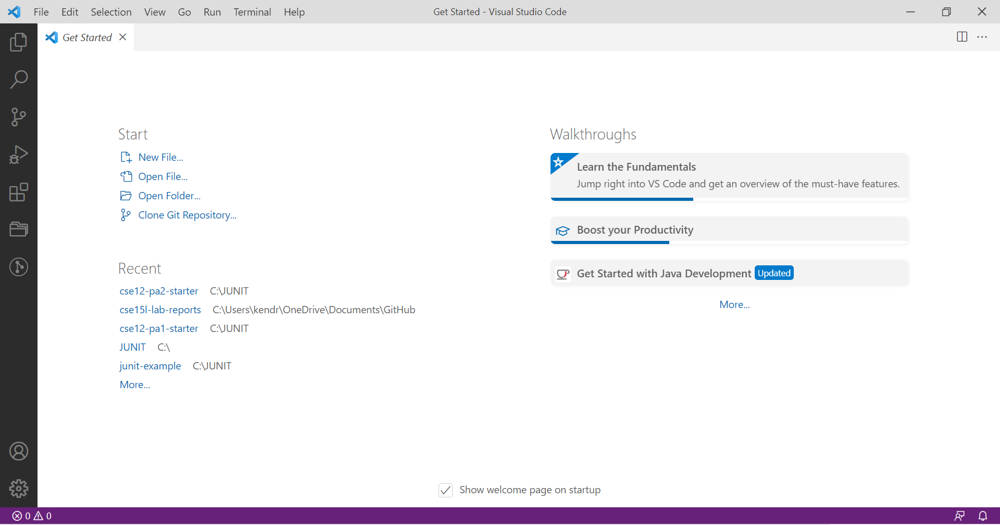
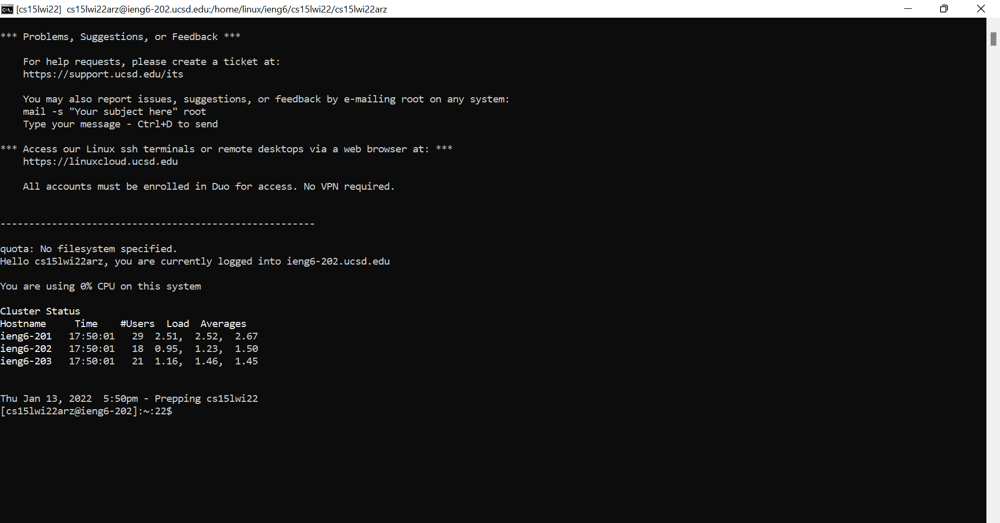
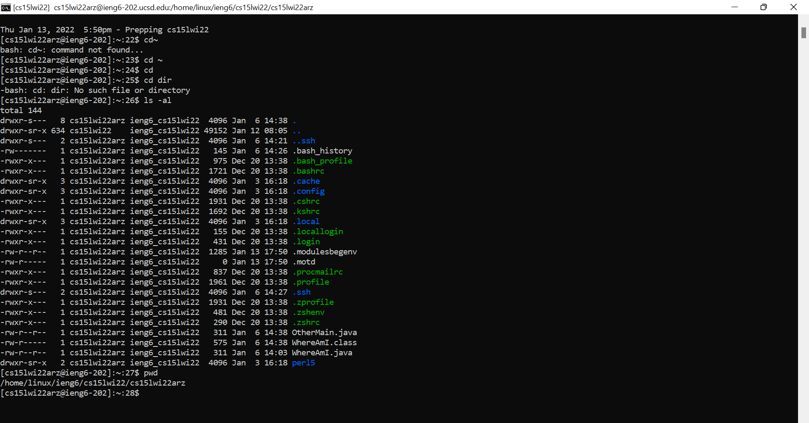
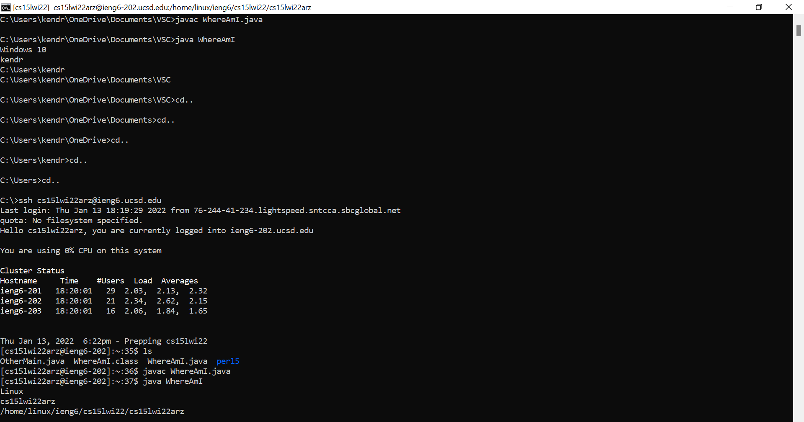
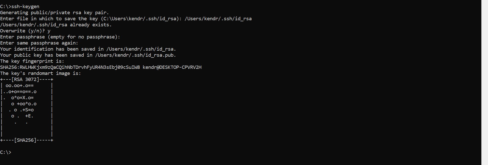
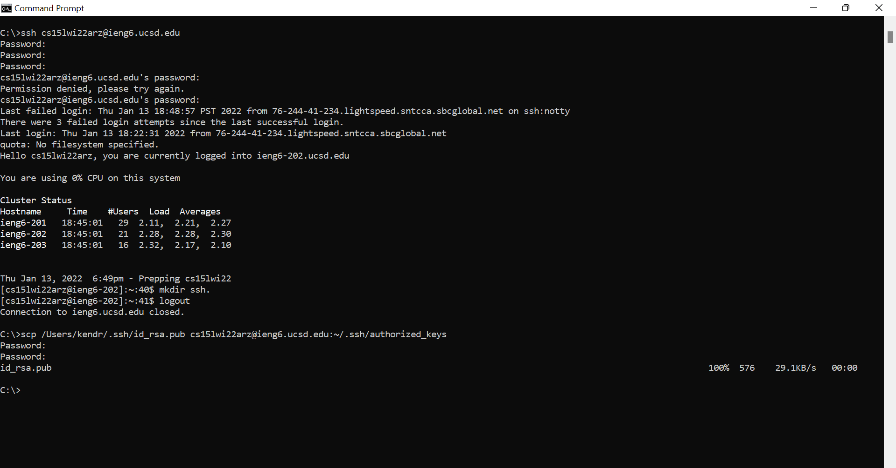
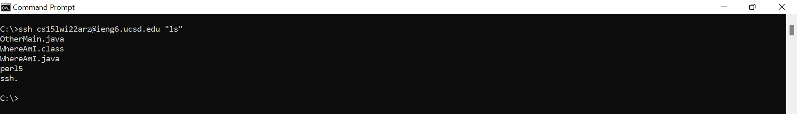
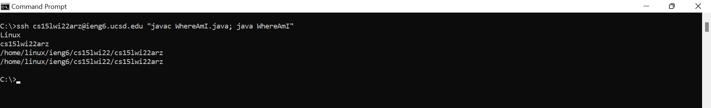

# **LAB 1 REPORT**
#### (A16282947)
<br/>

Hello 15L students! The following is a tutorial on how to log into a course-specific account on ieng6. To do so, we will cover these few tasks:

1. Installing Visual Studio Code
2. Remotely connecting to a UCSD server
3. Inputting commands from your client
4. Moving files with "scp"
5. Setting an SSH key
6. Optimizing remote running

<br/>

### **Step 1:**
#### Installing VScode
Download "Visual Studio Code" from this link: [https://code.visualstudio.com/](https://code.visualstudio.com/)

Follow the instructions according to the website; this process will differ depending on if you operate on, for example, OSX or Windows.



Your setup should look something like this!
<br/>
### **Step 2:**
#### Remotely Connecting
<br/>

> FOR WINDOWS USERS ONLY:
- Before getting to the UCSD server, we have to install a program called OpenSSH, which allows us to connect remotely.
- Navigate to "Optional Features" in "Settings." Search and install OpenSSH Client and OpenSSH Server. When you are done, proceed with the next steps!

<br/>

Find your account for the CSE 15L class here: [https://sdacs.ucsd.edu/~icc/index.php](https://sdacs.ucsd.edu/~icc/index.php)

The course is located under "Additional Accounts." Locate your account. It will be something similar to cs15lwi22**zz**@ieng6.ucsd.edu, except the "**zz**" will be letters specific to your UCSD account.

Next, open a terminal in Visual Studio Code or open a Command Prompt.
Input the following command: `ssh cs15lwi22zz@ieng6.ucsd.edu`

This message may pop up:
```
The authenticity of host 'ieng6.ucsd.edu (128.54.70.227)' can't be established.
RSA key fingerprint is SHA256:ksruYwhnYH+sySHnHAtLUHngrPEyZTDl/1x99wUQcec.
Are you sure you want to continue connecting (yes/no/[fingerprint])?
```
Type in yes, press enter, and give your password (it will not appear on the screen for security reasons)!

When your screen looks like this, you are ready to move on!


<br/>
### **Step 3:**
#### Trying Some Commands

Give yourself sometime to play around with the Visual Studio Code terminal or Command Prompt, both on the client (your computer) and the server (the remote connection). To get on the UCSD server, repeat the `ssh cs15lwi22zz@ieng6.ucsd.edu` command from Step 2!

Here are some commands to try:

`cd ~`<br/>
`cd`<br/>
`cd dir`<br/>
`ls -al`<br/>
`pwd`<br/>

Like this:


<br/>
### **Step 4:**
#### Moving Files with "scp"

You are almost done! Our goal is to be able to work between our computer and the remote computer, so one skill that is important is copying files over. We can do this by using the command `scp`.

Create a file `WhereAmI.java` with the following contents:
```
class WhereAmI {
  public static void main(String[] args) {
    System.out.println(System.getProperty("os.name"));
    System.out.println(System.getProperty("user.name"));
    System.out.println(System.getProperty("user.home"));
    System.out.println(System.getProperty("user.dir"));
  }
}
```
Compile this file with the command `javac` and then run it with the command `java` **on your computer**. Note that this will only work if you have Java already installed.

Repeat these commands but this time on the remote server. Because the UCSD computers have Java set up, this should work for everyone.

If you type `ls` in the command prompt, you should see the file in the home directory!


<br/>
### **Step 5:**
#### Setting an SSH Key

We can make signing into the UCSD server faster and easier by getting rid of our password altogether, and we do so by using the ssh keys.

Follow this next code as shown here, starting with `ssh-keygen`. Read carefully and make changes according to the name of your user.



We need to copy this to our account on the UCSD server.
Follow this code now, starting with `ssh cs15lwi22zz@ieng6.ucsd.edu`. Remember to change **zz** to your account's letters.



When it asks for the password, press your enter key to save the action as your new password. Now, we can get ahold of the server without entering any password!
<br/>
### **Step 6:**
#### Optimizing Remote Running

It is time to combine everything we have learned together! We know how to run code on the remote server without needing to enter a password and we know what a few command lines can do!

Here are some more shortcuts:

This format will allow us to log onto the remote server and run code in one line!
```
ssh cs15lwi22zz@ieng6.ucsd.edu "ls"
```

This format is a way to write multiple commands in one line!
```
javac WhereAmI.java; java WhereAmI
```


<br/>

---
<br/>

## **Congratulations! You have finished the tutorial!** ✔️