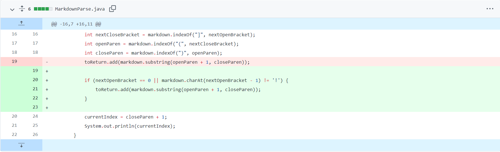

# **LAB 2 REPORT**


We were originally running `MarkdownParse.java` to pull links from Markdown files:
```
import java.io.IOException;
import java.nio.file.Files;
import java.nio.file.Path;
import java.util.ArrayList;

public class MarkdownParse {
    public static ArrayList<String> getLinks(String markdown) {
        ArrayList<String> toReturn = new ArrayList<>();
        
        int currentIndex = 0;
        while(currentIndex < markdown.length()) {
            int nextOpenBracket = markdown.indexOf("[", currentIndex);
            System.out.println(currentIndex);

            int nextCloseBracket = markdown.indexOf("]", nextOpenBracket);
            int openParen = markdown.indexOf("(", nextCloseBracket);
            int closeParen = markdown.indexOf(")", openParen);
            toReturn.add(markdown.substring(openParen + 1, closeParen));
            currentIndex = closeParen + 1;

            System.out.println(currentIndex);
        }
        return toReturn;
        
    }
    public static void main(String[] args) throws IOException {
		Path fileName = Path.of(args[0]);
	    String contents = Files.readString(fileName);
        ArrayList<String> links = getLinks(contents);
        System.out.println(links);
    }
}
```
In a Markdown file like `test-file.md`, we would receive this output.
```
[a link!](https://something.com)
[another link!](some-page.html)
```

`0`<br/>
`43`<br/>
`43`<br/>
`76`<br/>
`[https://something.com, some-page.html]`<br/>

The numbers are the index at every change, while the text within the brackets are what is recognized as a link. 

However, when we run the code with further Markdown files, said output can be unexpected and unwanted. Here are 3 examples where the code is adjusted to give accurate reports of any links found within a Markdown file.

<br/>

### **Example 1:**
####  Running a File With an Image
<br/>

In Markdown, a link is formatted like `[title](https://www.example.com)`, but because our code is looking for parantheses and brackets, an image, or `` will be considered a link.

This is **test2-file.md** : [https://github.com/kkbunny247/markdown-parse/blob/main/test2-file.md](https://github.com/kkbunny247/markdown-parse/blob/main/test2-file.md)

```
[link](link.com)

```
We will end up with something like this, which is incorrect since it is producing an output where `image.jpeg` is a link.


We can fix our code by adding an *if statement* to make sure that the first character of the line is `[` or that the character before our opening bracket is not `!`. 



> **- THE BUG:** We were not specifically defining how the code should identify a link. As long as an input had an opening bracket ( `[` ) , a closing braket ( `]` ) , and paratheses ( `(` `)` ), it was added to the arraylist. <br/> 
**- THE SYMPTOM:** An input that was not a link like (image.jpeg) was included. <br/>
**- THE FIX:**  `nextOpenBracket == 0` is considering if the link is included on a new line, while `markdown.charAt(nextOpenBracket - 1) != '!')` is considering if the link has characters in front of it. In both cases, we are restricting what can appear before the open bracket to ensure that it will be a link that the code is scanning.

<br/>

### **Step 2:**
#### Remotely Connecting
<br/>

> FOR WINDOWS USERS ONLY:
- Before getting to the UCSD server, we have to install a program called OpenSSH, which allows us to connect remotely.
- Navigate to "Optional Features" in "Settings." Search and install OpenSSH Client and OpenSSH Server. When you are done, proceed with the next steps!

<br/>

Find your account for the CSE 15L class here: [https://sdacs.ucsd.edu/~icc/index.php](https://sdacs.ucsd.edu/~icc/index.php)

The course is located under "Additional Accounts." Locate your account. It will be something similar to cs15lwi22**zz**@ieng6.ucsd.edu, except the "**zz**" will be letters specific to your UCSD account.

Next, open a terminal in Visual Studio Code or open a Command Prompt.
Input the following command: `ssh cs15lwi22zz@ieng6.ucsd.edu`

This message may pop up:
```
The authenticity of host 'ieng6.ucsd.edu (128.54.70.227)' can't be established.
RSA key fingerprint is SHA256:ksruYwhnYH+sySHnHAtLUHngrPEyZTDl/1x99wUQcec.
Are you sure you want to continue connecting (yes/no/[fingerprint])?
```
Type in yes, press enter, and give your password (it will not appear on the screen for security reasons)!

When your screen looks like this, you are ready to move on!


<br/>
<br/>

### **Step 3:**
#### Trying Some Commands

Give yourself sometime to play around with the Visual Studio Code terminal or Command Prompt, both on the client (your computer) and the server (the remote connection). To get on the UCSD server, repeat the `ssh cs15lwi22zz@ieng6.ucsd.edu` command from Step 2!

Here are some commands to try:

`cd ~`<br/>
`cd`<br/>
`cd dir`<br/>
`ls -al`<br/>
`pwd`<br/>


<br/>
<br/>

Happy coding!