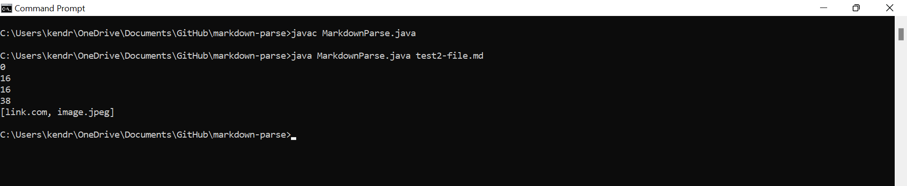

# **LAB 2 REPORT**


We were originally running `MarkdownParse.java` to pull links from Markdown files:
```
import java.io.IOException;
import java.nio.file.Files;
import java.nio.file.Path;
import java.util.ArrayList;

public class MarkdownParse {
    public static ArrayList<String> getLinks(String markdown) {
        ArrayList<String> toReturn = new ArrayList<>();
        
        int currentIndex = 0;
        while(currentIndex < markdown.length()) {
            int nextOpenBracket = markdown.indexOf("[", currentIndex);
            System.out.println(currentIndex);

            int nextCloseBracket = markdown.indexOf("]", nextOpenBracket);
            int openParen = markdown.indexOf("(", nextCloseBracket);
            int closeParen = markdown.indexOf(")", openParen);
            toReturn.add(markdown.substring(openParen + 1, closeParen));
            currentIndex = closeParen + 1;

            System.out.println(currentIndex);
        }
        return toReturn;
        
    }
    public static void main(String[] args) throws IOException {
		Path fileName = Path.of(args[0]);
	    String contents = Files.readString(fileName);
        ArrayList<String> links = getLinks(contents);
        System.out.println(links);
    }
}
```
In a Markdown file like `test-file.md`, we would receive this output.
```
[a link!](https://something.com)
[another link!](some-page.html)
```

`0`<br/>
`43`<br/>
`43`<br/>
`76`<br/>
`[https://something.com, some-page.html]`<br/>

The numbers are the index at every change, while the text within the brackets are what is recognized as a link. 

However, when we run the code with further Markdown files, said output can be unexpected and unwanted. Here are 3 examples where the code is adjusted to give accurate reports of any links found within a Markdown file.

<br/>

### **Example 1:**
####  Running a File With an Image

In Markdown, a link is formatted like `[title](https://www.example.com)`, but because our code is looking for brackets and parantheses, an image, or `` will be considered a link.

This is **test2-file.md** : [https://github.com/kkbunny247/markdown-parse/blob/main/test2-file.md](https://github.com/kkbunny247/markdown-parse/blob/main/test2-file.md) 

*for better viewing:* [https://github.com/kkbunny247/markdown-parse/blame/main/test2-file.md](https://github.com/kkbunny247/markdown-parse/blame/main/test2-file.md) 

```
[link](link.com)

```
We will end up with something like this, which is incorrect since it is producing an output where `image.jpeg` is a link.



We can fix our code by adding an *if statement* to make sure that the first character of the line is `[` or that the character before our opening bracket is not `!`. 


<br/>

> **- THE BUG:** We were not specifically defining how the code should identify a link. As long as an input had an opening bracket ( `[` ) , a closing braket ( `]` ) , and paratheses ( `(` `)` ), it was added to the arraylist. <br/> <br/> 
**- THE SYMPTOM:** An input that was not a link like (image.jpeg) was included. <br/> <br/> 
**- THE FIX:**  `nextOpenBracket == 0` is considering if the link is included on a new line, while `markdown.charAt(nextOpenBracket - 1) != '!')` is considering if the link has characters in front of it. In both cases, we are restricting what can appear before the open bracket to ensure that it will be a link that the code is scanning.

<br/>

### **Example 2:**
#### Interrupting the Link Format

What happens if there were words in between our brackets and parantheses? Again, a link is formatted like `[title](https://www.example.com)`, but our code does not ensure that there is nothing from `]` to `(`. 

This is **test3-file.md** : [https://github.com/kkbunny247/markdown-parse/blob/main/test3-file.md](https://github.com/kkbunny247/markdown-parse/blob/main/test3-file.md) 

*for better viewing:* [https://github.com/kkbunny247/markdown-parse/blame/main/test3-file.md](https://github.com/kkbunny247/markdown-parse/blame/main/test3-file.md)

```
[link] words (www.something.com)
```
We will end up with something like this, which is incorrect since our input is not really a link. 


We can fix our code by adding to our *if statement*. This will make sure that `(` is the character coming right after `]`. 


> **- THE BUG:** We did not specify that there should be nothing in between our brackets and parantheses. Our code was only looking for an opening bracket ( `[` ) , a closing braket ( `]` ) , and a set of paratheses ( `(` `)` ). <br/> <br/> 
**- THE SYMPTOM:** An input that was not a link or formatted like one like `[link] words (www.something.com)` was included. <br/> <br/> 
**- THE FIX:**  Adding onto the previous code changes with `&&`, `nextCloseBracket == openParen - 1` looks to find that the the closing bracket is neighboring the open paranthesis. We are getting to be more restrictive of what can be passed as a link by clarifying its structure in the Markdown file.

<br/>

### **Example 3:**
#### Spacey Links?

A valid link does not have spaces, so we can modify our code to start returning only valid links. We can do this by searching for spaces in between our parantheses. 

This is **test4-file.md** : [https://github.com/kkbunny247/markdown-parse/blob/main/test4-file.md](https://github.com/kkbunny247/markdown-parse/blob/main/test4-file.md) 

*for better viewing:* [https://github.com/kkbunny247/markdown-parse/blame/main/test4-file.md](https://github.com/kkbunny247/markdown-parse/blame/main/test4-file.md)

```
[link](not a link ! ! !)
```
We will end up with something like this, which is incorrect since we have decided that our code should only return valid links. 


We can fix our code by adding another *if statement* to check for no spaces in between our parantheses. 


> **- THE BUG:** We did not specify that there should be nothing in between our brackets and parantheses. Our code was only looking for an opening bracket ( `[` ) , a closing braket ( `]` ) , and a set of paratheses ( `(` `)` ). <br/> <br/> 
**- THE SYMPTOM:** An input that was not a link or formatted like one like `[link] words (www.something.com)` was included. <br/> <br/> 
**- THE FIX:**  Adding onto the previous code changes with `&&`, `nextCloseBracket == openParen - 1` looks to find that the the closing bracket is neighboring the open paranthesis. We are getting to be more restrictive of what can be passed as a link by clarifying its structure in the Markdown file.

<br/>
<br/>

Happy coding!