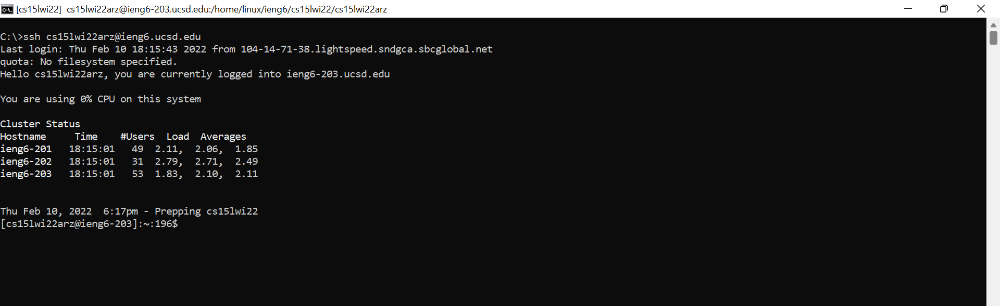

# **LAB 3 REPORT**


So far, everytime we have want to remotely connect to the UCSD server, we have been having to enter `ssh cs15lwi22zzz@ieng6.ucsd.edu`. Hopefully, you have been utilizing `Ctrl C` and `Ctrl V` to copy-paste the line into your command prompt (unless you really remembered the entire `ssh cs15lwi22zzz@ieng6.ucsd.edu` ... ). 

No worries! We can make this process of logging into our `ieng6` account much faster and simpler. The following is a tutorial on streamlining our `ssh` configuration.

<br/>

> FOR WINDOWS USERS ONLY:
- This should be done already, as it was required to get to the UCSD server in the first place, but if you have not done so yet, please install a program called OpenSSH!
- Find "Optional Features" in "Settings." Search and install OpenSSH Client and OpenSSH Server. When you are done, we can get on with the next steps!

<br/>

### **Navigating to .ssh/config**

The folder `.ssh` should be in the home directory of your computer. A home directory has a path similar to this:
```
C:\Users\kendr\.ssh
```

Within the folder, there will be a file named `config`. If it is not there, we can simply make one now.

`config` should have the following contents and be located inside the folder `.ssh`.
```
Host ieng6
    HostName ieng6.ucsd.edu
    User cs15lwi22zzz
    IdentityFile ~/.ssh/id_rsa
```
```
C:\Users\kendr\.ssh\config
```
Remember that the "**zzz**" are the letters specific to your UCSD account!

The setup in your coding environment will look something like this.


<br/>

### **Running ssh ieng6**

Now to connect to our remote account on the UCSD server, we can enter `ssh ieng`!

#### **before**



#### **after**


<br/>

### **Congratulations! You have successfully created your shortcut to `ieng6`** 😊