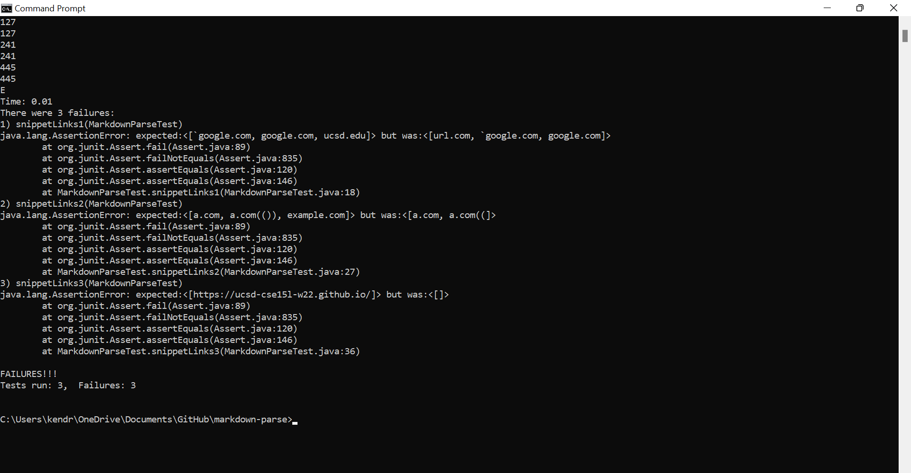
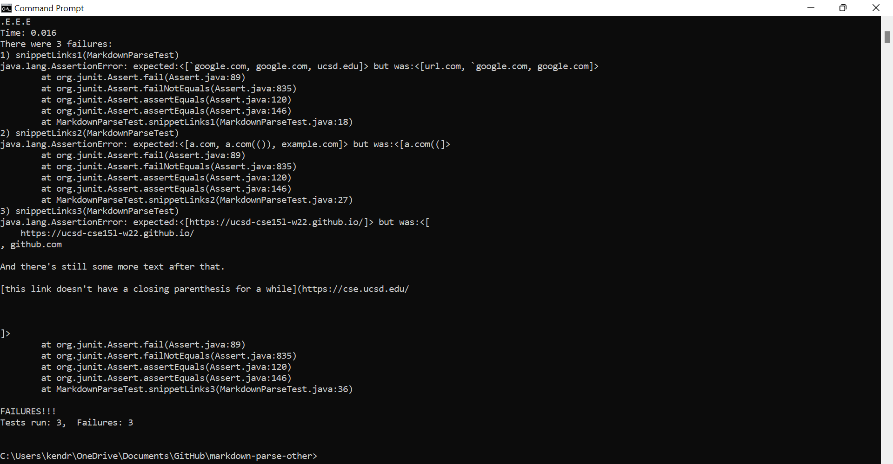

# **LAB 4 REPORT**


### **The Setup**

We are going to be running more tests against our `MarkdownParse.java` file as well as another student's `MarkdownParse.java` file.
#### **MY REPOSITORY:** [https://github.com/kkbunny247/markdown-parse](https://github.com/kkbunny247/markdown-parse)

#### **REVIEWED REPOSITORY:** [https://github.com/sallada1/markdown-parse](https://code.visualstudio.com/)

<br/>

From the following 3 Markdown files, the code in `MarkdownParse` should pull the links.

#### **Test 1** 
```
1   `[a link`](url.com)
2
3   [another link](`google.com)`
4
5   [`cod[e`](google.com)
6
7   [`code]`](ucsd.edu)
```
#### **Test 2** 
```
1   [a [nested link](a.com)](b.com)
2
3   [a nested parenthesized url](a.com(()))
4
5   [some escaped \[ brackets \]](example.com)
```

#### **Test 3** 
```
1   [this title text is really long and takes up more than 
2   one line
3
4   and has some line breaks](
5       https://www.twitter.com
6   )
7
8   [this title text is really long and takes up more than 
9   one line](
10      https://ucsd-cse15l-w22.github.io/
11  )
12
13
14  [this link doesn't have a closing parenthesis](github.com
15
16  And there's still some more text after that.
17
18  [this link doesn't have a closing parenthesis for a while](https://cse.ucsd.edu/
19
20
21
22  )
23
24  And then there's more text
```
<br/>

### **Determining Our Tests**

From the CommonMark demo site ([https://spec.commonmark.org/dingus/](https://spec.commonmark.org/dingus/)), we can figure out what is in fact accepted as a link in Markdown and determine what to put in the JUnit tests in `MarkdownParseTest.java`.

#### **Test 1 Results** 


Only Line 3, ``[another link](`google.com)`‎`` will produce a link. This link would be **`google.com**.<br/>

<br/>

#### **Test 2 Results** 


Part of Line 1 and then Lines 3 and 5 will produce a link: ``[nested link](a.com)``, ``[a nested parenthesized url](a.com(()))``, and ``[some escaped \[ brackets \]](example.com)``. The links would be **a.com**, **a.com(())**, and **example.com**.

<br/>

#### **Test 3 Results** 


Only Lines 8-11, which starts at ``[this title text is really long...`` and ends at ``https://ucsd-cse15l-w22.github.io/)`` will produce a link. This link would be **https<nolink>://ucsd-cse15l-w22.github.io/**.

<br/>

Thus, our tests in the `MarkdownParseTest.java` file of both repositories will look something like this.

```
import static org.junit.Assert.*;
import org.junit.*;
import java.io.IOException;
import java.nio.file.Files;
import java.nio.file.Path;
import java.util.ArrayList;
import java.util.List;

public class MarkdownParseTest {

    // ------------ Snippet Tests ---------------

    @Test
    public void snippetLinks1() throws IOException {
        Path fileName = Path.of("snippet-1.md");
	    String contents = Files.readString(fileName);

        assertEquals(List.of("`google.com"), MarkdownParse.getLinks(contents));
    }

    @Test
    public void snippetLinks2() throws IOException {
        Path fileName = Path.of("snippet-2.md");
	    String contents = Files.readString(fileName);

        assertEquals(List.of("a.com", "a.com(())", "example.com"), 
            MarkdownParse.getLinks(contents));
    }

    @Test
    public void snippetLinks3() throws IOException {
        Path fileName = Path.of("snippet-3.md");
	    String contents = Files.readString(fileName);

        assertEquals(List.of("https://ucsd-cse15l-w22.github.io/"),
            MarkdownParse.getLinks(contents));
    }
}
```

<br/>

### **Running and Making Changes**

Here are the corresponding outputs of the `MarkdownParseTest.java` files.

#### **MY REPOSITORY:** 



#### **REVIEWED REPOSITORY:** 
