# **LAB 5 REPORT**


We are going to be comparing the results of two `MarkdownParse.java` implementations when they run the tests from the `test-files` folder.

#### **STUDENT REPOSITORY:** [https://github.com/m1ma0314/markdown-parse](https://github.com/m1ma0314/markdown-parse)

<br/>

We found the differences between the test results by using the program `diff`, which compares files line by line and produces an output that shows exactly where the files vary.

This is what we enter on the terminal or Command Prompt if `results.txt` is the output of `test-files`:
```
diff some-markdown-parse/results.txt other-markdown-parse/results.txt > resultsDiffs.txt
```
<br/>

### **Test File #490**
```
[link](<foo
bar>)
```
#### **student results:** 
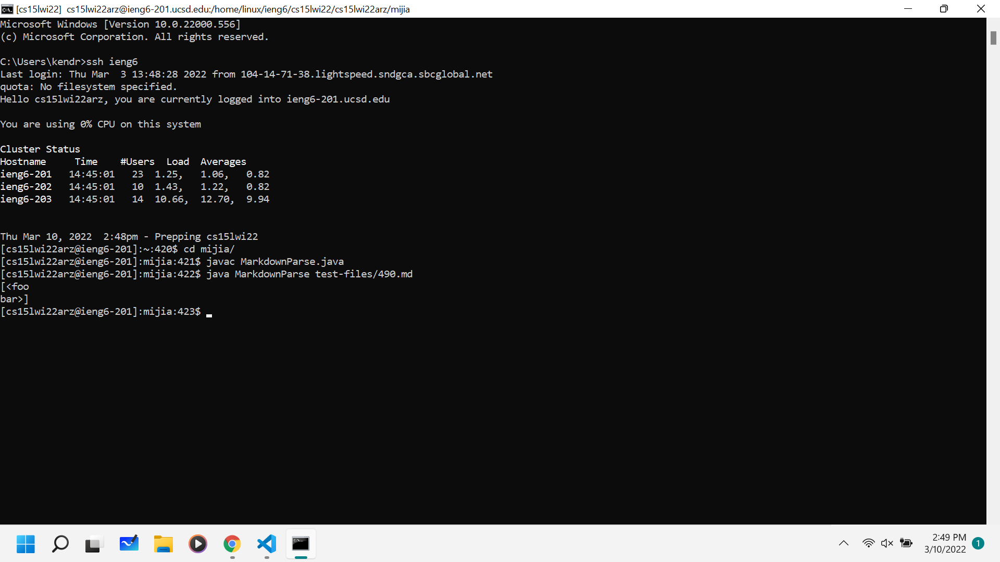

#### **class results:** 
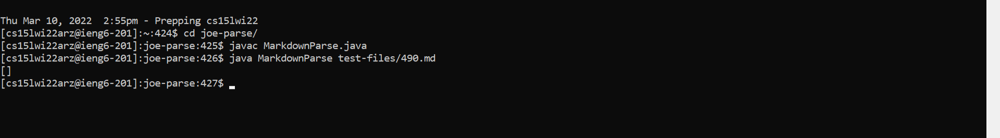

#### **EXPECTED OUTPUT** 
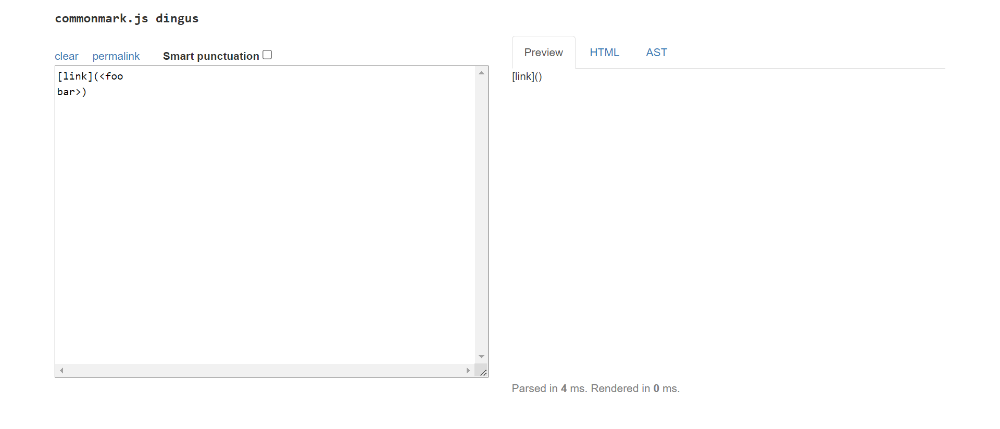

Using CommonMark, we see that the **class implementation** is correct because it produces `[]`, as `<foo
bar>` should not be recognized as a link. 

The ***bug*** in the student implementation is that the code in `MarkdownParse.java` allows links to span over a line or after a line break. 

<br/>

#### **THE FIX** 
Before our code adds the potential link to the arraylist, we can use the *trim* method on what is inside the parentheses: this gets rid of trailing and leading spaces. We can also add an *if statement* that will check for whether or not there is a space or line break inside the parentheses.
```
String potentialLink = markdown.substring(openParen + 1, 
   closeParen).trim();

if (potentialLink.indexOf(" ") == -1 && potentialLink.indexOf
   ("\n") == -1) {
   toReturn.add(potentialLink);
   currentIndex = closeParen + 1;
}
else {
   currentIndex = currentIndex + 1;
}
```

After editing the file using `vim`, we see that making the change to the code gives us the correct output (changes were made at the cursor).

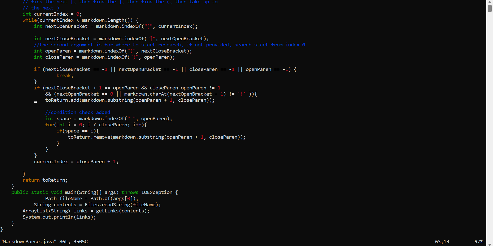

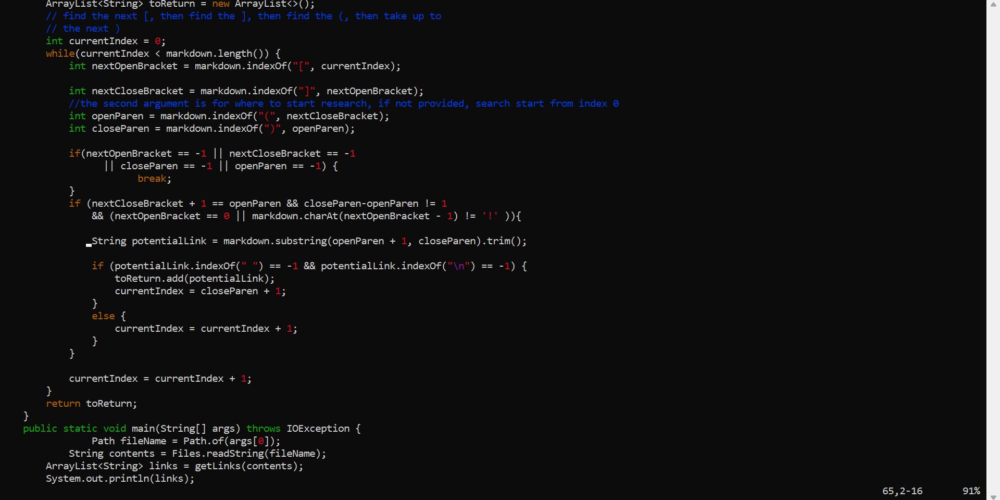

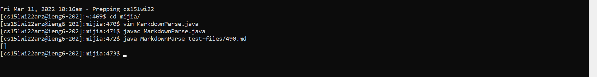

<br/>

### **Test File #510**
```
[link] (/uri)
```

#### **student results:** 
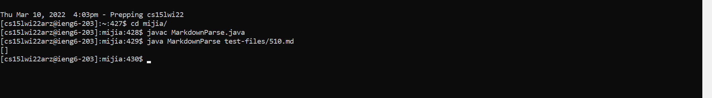

#### **class results:** 
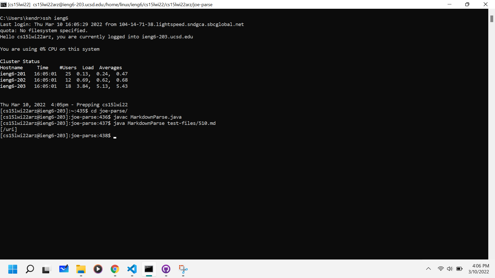

#### **EXPECTED OUTPUT** 
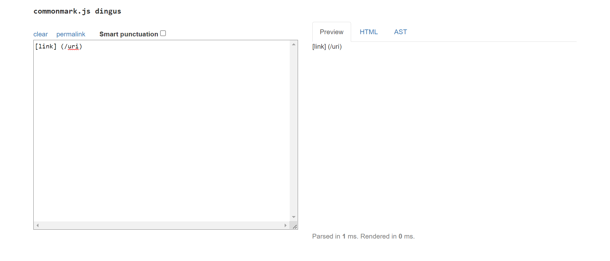

Using CommonMark, we see that the **student implementation** is correct because it produces `[]`, as `/uri` should not be recognized as a link. 

The ***bug*** in the class implementation is that the code in `MarkdownParse.java` still recognizes the link even when there is a space between the closing bracket and opening parenthesis.

<br/>

#### **THE FIX** 
We can add an *if statement* before our code adds the potential link to the arraylist in order to check for whether or not there is a space between the closed bracket and open parenthesis.
```
if (nextCloseBracket != openParen - 1) {
   return toReturn; 
}
```

After editing the file using `vim`, we see that making the change to the code gives us the correct output (changes were made at the cursor).

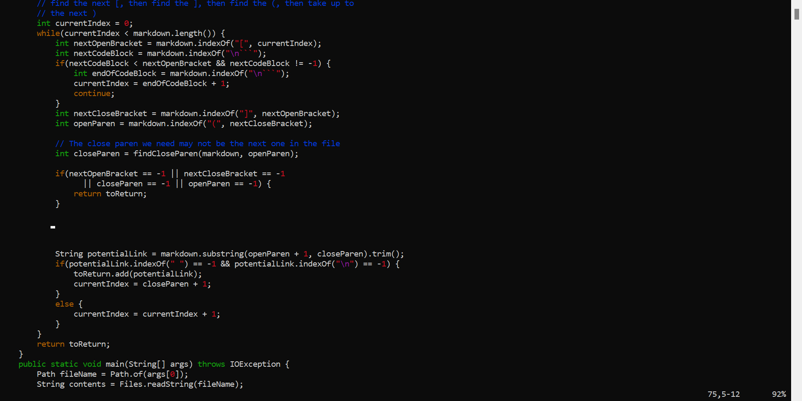

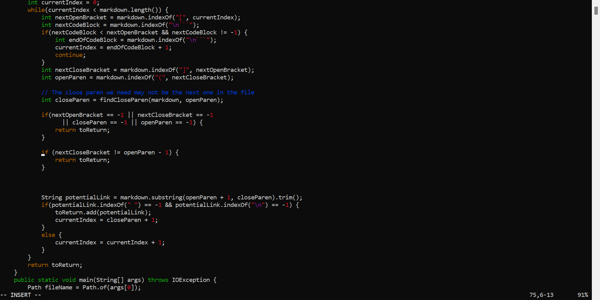

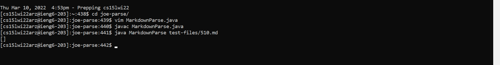

<br/>

### This marks the end of CSE 15L! 🎉