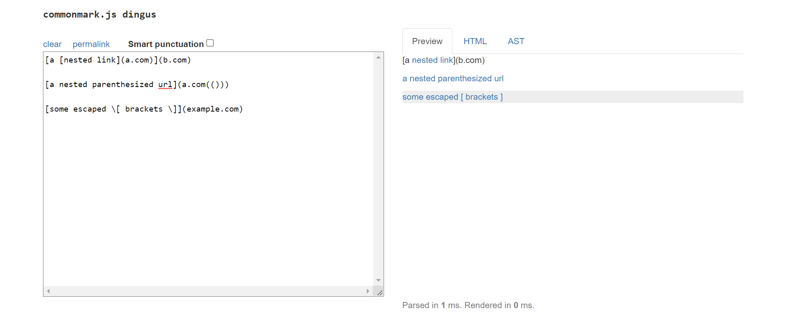

# **LAB 5 REPORT**


We are going to be looking for differences in the results of two implementations of `MarkdownParse.java` when they run the test files from the `test-files` folder.

These we can compare line-by-line. In fact, there are programs to help us do so! There is a program called diff that is for just the purpose of showing the differences between files.

diff takes two files as arguments and shows their differences in a stylized format I did this on two different implementations that I happened to have checked out (remember, your paths and filenames might be different!) and got this result:

comparing the In lab 9, you experimented with the many tests provided from commonmark-spec. For this lab report, choose any two tests from the 652 commonmark-spec tests where your implementation (or a representative implementation from your group) had different answers than the implementation we provided for lab 9. 
We are going to be running more tests against our `MarkdownParse.java` file as well as another student's `MarkdownParse.java` file.
#### **GROUP REPOSITORY:** [https://github.com/kkbunny247/markdown-parse](https://github.com/kkbunny247/markdown-parse)

#### **REVIEWED REPOSITORY:** [https://github.com/sallada1/markdown-parse](https://code.visualstudio.com/)

<br/>

### **The Setup**

From the following 3 Markdown files, the code in `MarkdownParse` should pull the links.

#### **Test 1** 
```
1   `[a link`](url.com)
2
3   [another link](`google.com)`
4
5   [`cod[e`](google.com)
6
7   [`code]`](ucsd.edu)
```
#### **Test 2** 
```
1   [a [nested link](a.com)](b.com)
2
3   [a nested parenthesized url](a.com(()))
4
5   [some escaped \[ brackets \]](example.com)
```

#### **Test 3** 
```
1   [this title text is really long and takes up more than 
2   one line
3
4   and has some line breaks](
5       https://www.twitter.com
6   )
7
8   [this title text is really long and takes up more than 
9   one line](
10      https://ucsd-cse15l-w22.github.io/
11  )
12
13
14  [this link doesn't have a closing parenthesis](github.com
15
16  And there's still some more text after that.
17
18  [this link doesn't have a closing parenthesis for a while](https://cse.ucsd.edu/
19
20
21
22  )
23
24  And then there's more text
```
<br/>

### **Determining Our Tests**

From the CommonMark demo site ([https://spec.commonmark.org/dingus/](https://spec.commonmark.org/dingus/)), we can figure out what is in fact accepted as a link in Markdown and determine what to put in the JUnit tests in `MarkdownParseTest.java`.

#### **Test 1 Results** 


Lines 3, 5, and 7 will produce a link: ``[another link](`google.com)`‎``,  ``[`cod[e`](google.com)``, and ``[`code]`](ucsd.edu)``. This links would be **`google.com**. **google.com**, and **ucsd.edu**.<br/>

<br/>

#### **Test 2 Results** 


Part of Line 1 and then Lines 3 and 5 will produce a link: ``[nested link](a.com)``, ``[a nested parenthesized url](a.com(()))``, and ``[some escaped \[ brackets \]](example.com)``. The links would be **a.com**, **a.com(())**, and **example.com**.

<br/>

#### **Test 3 Results** 


Only Lines 8-11, which starts at ``[this title text is really long...`` and ends at ``https://ucsd-cse15l-w22.github.io/)`` will produce a link. This link would be **https<nolink>://ucsd-cse15l-w22.github.io/**.

<br/>

Thus, our tests in the `MarkdownParseTest.java` file of both repositories will look something like this.

```
import static org.junit.Assert.*;
import org.junit.*;
import java.io.IOException;
import java.nio.file.Files;
import java.nio.file.Path;
import java.util.ArrayList;
import java.util.List;

public class MarkdownParseTest {

    // ------------ Snippet Tests ---------------

    @Test
    public void snippetLinks1() throws IOException {
        Path fileName = Path.of("snippet-1.md");
	    String contents = Files.readString(fileName);

        assertEquals(List.of("`google.com", "google.com", "ucsd.edu"), 
            MarkdownParse.getLinks(contents));
    }

    @Test
    public void snippetLinks2() throws IOException {
        Path fileName = Path.of("snippet-2.md");
	    String contents = Files.readString(fileName);

        assertEquals(List.of("a.com", "a.com(())", "example.com"), 
            MarkdownParse.getLinks(contents));
    }

    @Test
    public void snippetLinks3() throws IOException {
        Path fileName = Path.of("snippet-3.md");
	    String contents = Files.readString(fileName);

        assertEquals(List.of("https://ucsd-cse15l-w22.github.io/"),
            MarkdownParse.getLinks(contents));
    }
}
```

<br/>

### **Running `MarkdownParseTest`**

Here are the corresponding outputs of the `MarkdownParseTest.java` files.

#### **MY REPOSITORY:** 


None of the tests pass. Here are the specific errors.
```
Test 1
expected:<[`google.com, google.com, ucsd.edu]> but was:<[url.com, `google.com, google.com]>

Test 2
expected:<[a.com, a.com(()), example.com]> but was:<[a.com, a.com((]>

Test 3
expected:<[https://ucsd-cse15l-w22.github.io/]> but was:<[]>
```

#### **REVIEWED REPOSITORY:** 


None of the tests pass again. Here are the specific errors.
```
Test 1
expected:<[`google.com, google.com, ucsd.edu]> but was:<[url.com, `google.com, google.com]>

Test 2
expected:<[a.com, a.com(()), example.com]> but was:<[a.com((]>

Test 3
expected:<[https://ucsd-cse15l-w22.github.io/]> but was:<[
    https://ucsd-cse15l-w22.github.io/
, github.com

And there's still some more text after that.

[this link doesn't have a closing parenthesis for a while](https://cse.ucsd.edu/


]>
```
<br/>

### **Changing Our Program**

#### **Test 1** 
Our code already correctly detects the links in Lines 3 and 5. To account for cases that use inline code with backticks like Line 1, we can check for what is in front of the open bracket, similar to how we checked for exclamation marks and Markdown images. Our code would check that there is no backtick before the open bracket if there is a backtick in between the brackets.
```
String text = markdown.substring(nextOpenBracket, lastCloseBracket);

if (text.contains("`")) {
    if (nextOpenBracket == 0 || markdown.charAt(nextOpenBracket - 1) != '`') {
        toReturn.add(markdown.substring(openParen + 1, closeParen));
    }
}
else {
    toReturn.add(markdown.substring(openParen + 1, closeParen));
}
```
For Line 7, we can approach it slightly differently because **ucsd.edu** is not recognized due to the addition of `]` and not the backticks. We can add code to find the last close bracket rather than the next, and then check that the last close bracket is adjacent to a open parenthesis.
```
int lastCloseBracket = markdown.lastIndexOf("]", openParen);
int lastOpenBracket = markdown.lastIndexOf("]", lastCloseBracket);
            
if (lastCloseBracket < lastOpenBracket) {
    return toReturn;
}
```
<br/>

#### **Test 2** 
Our code already correctly detects the links in Line 1, and, after the corrections for Test 1, also Line 5. To account for cases where the link has nested parentheses like Line 3, an easy but more involved change would be to create a stack to make sure the parentheses are balanced. The reason it is recognized only up to **a.com((** is because our link is programmed to stop at the first appearance of a close parenthesis. 

<br/>

#### **Test 3**
We can narrow down that the reason Lines 8-11 are not recognized as a link is due to the line breaks in the parentheses. To account for cases that have new lines in parentheses, you can use the String trim() method to isolate the text surrounded by whitespaces. 
```
if (link.contains(" ")) {
    if (markdown.charAt(openParen + 1) != ' ' || 
        markdown.charAt(closeParen - 1) != ' ') {
        return toReturn;
    }
    else {
        link = link.trim();
    }
}
```

<br/>

### Happy coding! 😊